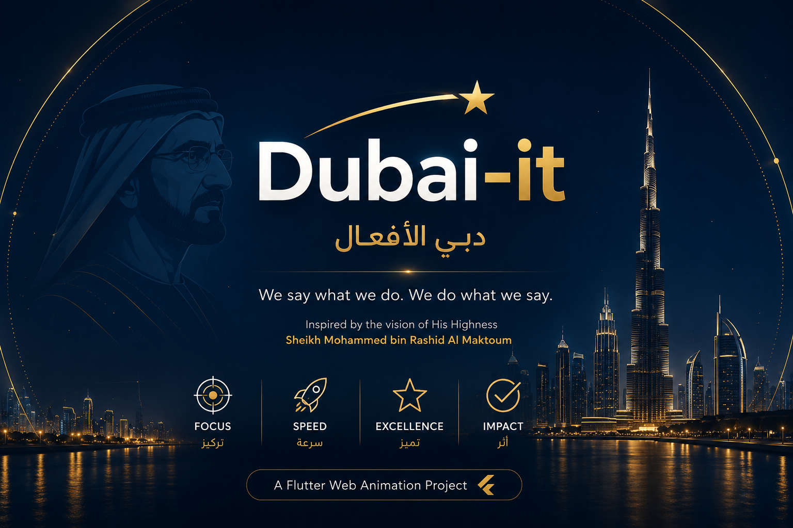
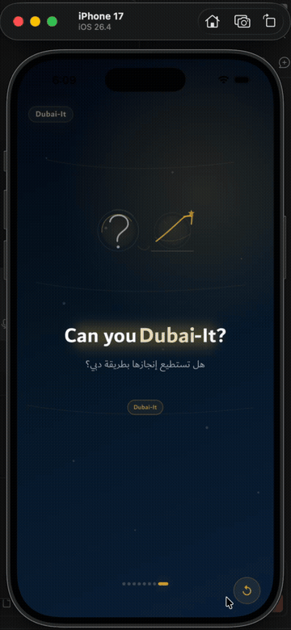

# Dubai-It — Native Flutter Web Animation

> دبي الأفعال · Dubai's philosophy of action, achievement, and execution

[](https://flutter.dev)
[](https://dart.dev)
[](https://mohamedabd0.github.io/dubai-it-animation/)
[](https://flutter.dev/web)

<br/>



A fully **native Flutter Web animation** that brings the **Dubai-It** initiative to life — no Lottie, no Rive, no video assets. Every scene is rendered with Flutter's `CustomPainter`, driven by `AnimationController`, and styled with the official **Dubai Font**, a deep navy palette, and gold motion accents.

**[▶ Open Live Demo](https://mohamedabd0.github.io/dubai-it-animation/)**

---

## Demo



[▶ Download full-quality demo.mov](https://github.com/MohamedAbd0/dubai-it-animation/raw/main/demo.mov)

---

## What is Dubai-It?

**Dubai-It / دبي الأفعال** is a leadership initiative inspired by the vision of **HH Sheikh Mohammed bin Rashid Al Maktoum** and **HH Sheikh Hamdan bin Mohammed**. It captures Dubai's philosophy of turning ambition into action — delivering exceptional results with speed, quality, and impact.

---

## Animation Scenes

The animation cycles through **8 scenes**, each pairing Arabic and English text with a custom visual:

| # | ID | Arabic | English | Source |
|---|-----|--------|---------|--------|
| 1 | `opening` | دبي الأفعال | Dubai-It | Dubai-It Initiative |
| 2 | `philosophy` | فلسفة دبي في العمل | Dubai's philosophy of work | HH Sheikh Mohammed bin Rashid |
| 3 | `core_meaning` | نتائج استثنائية في وقت قياسي | Exceptional results in record time | HH Sheikh Mohammed bin Rashid |
| 4 | `speed_quality` | السرعة لا تعني التسرّع والجودة لا تعني البطء | Speed does not mean haste · Quality does not mean slowness | HH Sheikh Mohammed bin Rashid |
| 5 | `execution` | الطموح لا يكتمل إلا بالتنفيذ | Ambition is completed through execution | HH Sheikh Mohammed bin Rashid |
| 6 | `hamdan_meaning` | تقديم شيء استثنائي بتميّز وسرعة وتأثير | Delivering something exceptional with excellence, speed and impact | HH Sheikh Hamdan bin Mohammed |
| 7 | `promise_action` | نقول ما نفعل… ونفعل ما نقول | We say what we do… and we do what we say | HH Sheikh Mohammed bin Rashid |
| 8 | `final_question` | هل تستطيع إنجازها بطريقة دبي؟ | Can you Dubai-It? | Dubai-It |

---

## Features

- **Zero external animation dependencies** — no Lottie, Rive, or video packages
- **Pure Flutter rendering** — all visuals built with `CustomPainter` and `AnimationController`
- **Bilingual layout** — Arabic (RTL) and English (LTR) text rendered side-by-side
- **Responsive** — adapts to mobile (< 600 px), tablet (600–1024 px), and desktop (> 1024 px)
- **Official Dubai Font** — Light, Regular, Medium, and Bold weights bundled in `assets/fonts/`
- **Dark navy + gold palette** — `#050814` → `#071A2F` → `#0B2545` background, `#D6A93A` gold accents
- **GitHub Pages ready** — CI/CD workflow deploys on every push to `main`

---

## Tech Stack

| Layer | Technology |
|-------|-----------|
| Framework | Flutter Web (stable) |
| Language | Dart ^3.12.2 |
| Rendering | `CustomPainter`, `AnimationController`, `Tween` |
| Typography | Dubai Font (bundled), Arial / Roboto fallback |
| Version management | FVM |
| Deployment | GitHub Pages via GitHub Actions |

---

## Project Structure

```
lib/
└── dubai_it/
    ├── dubai_it_animation_screen.dart  # Root screen & scene orchestration
    ├── dubai_it_background.dart        # Gradient navy background
    ├── dubai_it_scene.dart             # Scene data model
    ├── dubai_it_scene_view.dart        # Scene renderer
    ├── dubai_it_scenes.dart            # All 8 scene definitions
    ├── dubai_it_theme.dart             # Colors, typography & responsive layout
    ├── source_label.dart               # Attribution label widget
    ├── custom_scenes/                  # Full-screen custom scene widgets
    │   ├── opening_dubai_it_scene.dart
    │   └── final_question_scene.dart
    └── visuals/                        # CustomPainter visual components
        ├── dubai_it_glow_visual.dart
        ├── network_lines_visual.dart
        ├── exceptional_results_visual.dart
        ├── speed_quality_visual.dart
        ├── execution_visual.dart
        ├── excellence_speed_impact_visual.dart
        ├── promise_action_visual.dart
        └── final_question_visual.dart
```

---

## Requirements

- [FVM](https://fvm.app) — Flutter Version Management
- Flutter `stable` channel
- Chrome (for local web development)

---

## Getting Started

### 1. Install FVM and Flutter

```bash
dart pub global activate fvm
fvm install stable
fvm use stable
```

### 2. Install dependencies

```bash
fvm flutter pub get
```

### 3. Run locally

```bash
fvm flutter run -d chrome
```

---

## Build

### Standard web build

```bash
fvm flutter build web --release
```

### Build for GitHub Pages

The repository is pre-configured for the `/dubai-it-animation/` base path:

```bash
fvm flutter build web --release --base-href /dubai-it-animation/
```

> If the repository is renamed, update the `--base-href` value here and in `.github/workflows/deploy.yml`.

---

## Deployment

The project deploys automatically to **GitHub Pages** on every push to `main` via GitHub Actions.

**Live URL:** [https://mohamedabd0.github.io/dubai-it-animation/](https://mohamedabd0.github.io/dubai-it-animation/)

---

## Dubai Font

The official Dubai Font is bundled under `assets/fonts/`:

| File | Weight |
|------|--------|
| `Dubai-Light.ttf` | Light |
| `Dubai-Regular.ttf` | Regular |
| `Dubai-Medium.ttf` | Medium |
| `Dubai-Bold.ttf` | Bold |

The font files were sourced from Internet Archive captures of `dubaifont.com`. Use them in accordance with the official Dubai Font license terms.
